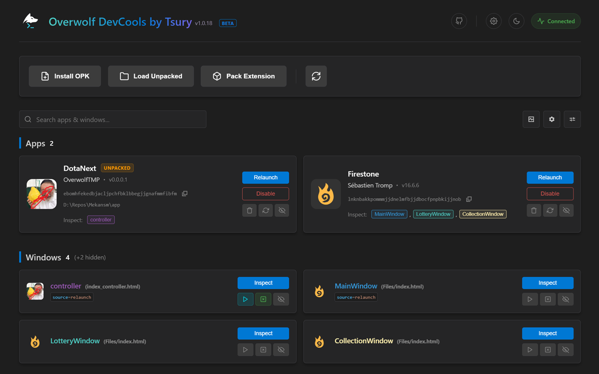

# Overwolf DevCools

  

**Supercharged Overwolf DevTools, straight in your Chrome browser.**

DevCools replaces the standard Overwolf Packages window with a modern, feature-rich dashboard running directly in Chrome. It connects to your local Overwolf developer environment to give you better control and visibility over your apps.

## Features

*   **Auto Open:** Automatically open DevTools when a specific window appears.
*   **Auto Open & Focus:** Hold `CTRL` when enabling Auto-Open to also automatically focus the DevTools window.
*   **Auto Close:** Automatically close the DevTools tab when the app window closes.
*   **Smart Tabs:** DevTools tabs now show the actual App Icon and Window Name instead of generic titles, making them easy to find.
*   **App Refresh:** Quickly restart an app (Disable -> Enable cycle) with one click.
*   **Visual Organization:** Apps and windows are color-coded for quick recognition.
*   **Clutter Control:** Hide specific apps or windows you don't need to see.
*   **Unpacked Indicator:** Clearly see which apps are loaded from disk (Unpacked) vs installed from the store.
*   **Themes:** Built-in Dark and Light modes.
*   **Non-Intrusive:** Runs entirely in Chrome, not injected into your games.

## Notes

*   **Requirement:** The Overwolf Packages window must be kept open for this extension to work.
*   **Work in Progress:** Not all features from the original Packages window have been ported yet. If you need something specific, please open a request!
*   **Privacy:** Everything runs locally on your machine. No data is transmitted outside.
*   **Disclaimer:** This project is not affiliated with Overwolf.

## Development

This project is 100% vibe coded by **Gemini 3 Pro**.

Pull Requests and Feature Requests are welcome!
